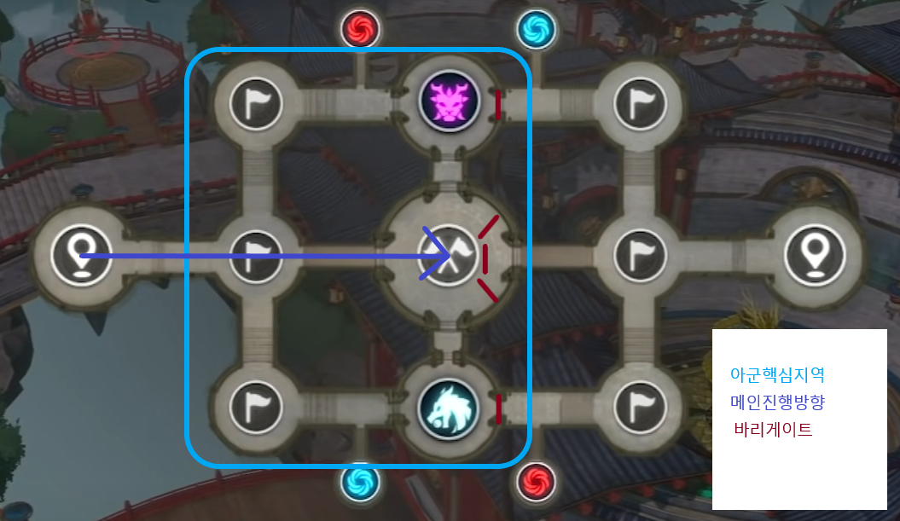
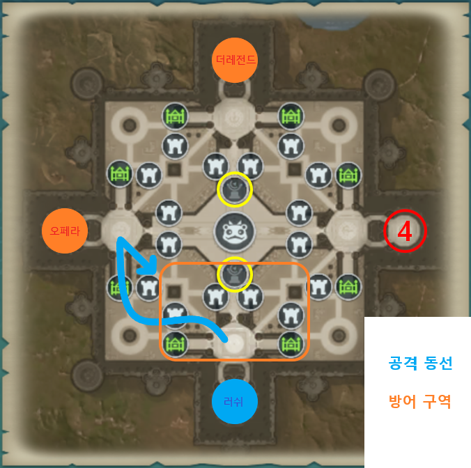

## [ **확인해주세요** ] \*\*

### [파티 편성(링크)](https://docs.google.com/spreadsheets/d/1WP76XHC7CoetG5YQLeLMjOujqW-wYe9T4EYkTjJWOaY/edit#gid=0)

## [ **참여해주세요** ] \*\*

### [디스코드(링크)](https://discord.gg/yufuZH9NKE)

### [카카오톡 - 공지방(링크)](https://open.kakao.com/o/gydbRCid)

### [카카오톡 - 대화방(링크)](https://open.kakao.com/o/gfkMyued)

### [카카오톡 - 정보방(링크)](https://open.kakao.com/o/g9tzFOid)

```sh
공지방 참여코드 : 43210
대화방 참여코드 : 43210
의견방 참여코드 : 59590
```

---

## [ **킹덤소개** ]

> 킹덤마스터 : **려늬**
>
> 킹덤부마스터 : **댄디형**
>
> 킹덤운영진 : **린D/** **부활한녹용군/** **요시/** **자이언트활/** **리오리아**

```sh
  킹덤은 남녀노소 함께 어우러지는 성인킹덤입니다.

 친목 커뮤니티 킹덤활동 지향으로 킹덤을 운영 할 예정이나 킹덤 참여율 순위는 1위를 목표로 단합심이 높은 킹덤입니다.

 오래도록 같이 플레이할 인원을 모집하여 끈끈함 바탕으로 단합되고 즐거운 킹덤이 될 수 있도록 운영하겠습니다.
```

## [ **가입조건** ]

- 투력 제한 : **160만**
- 가입 제한 : 부계정 / 이중 킹덤
- 필수 조건 : 카카오톡(공지방 / 대화방), 디스코드(듣기) 참여 가능

## [ **킹덤규칙-Era** ]

- 킹덤 출석 : 필수

  _사유없는 2일이상 미접은 제명_

- 킹덤 기부 : 필수

  _3가지 재화 풀기부_<br />
  _일요일기준 기여도 1,190 미만일시 다이아 충전 기부필수_

- 킹덤 내 외로 분란을 일으키는 행동( 막피 / 비매너 채팅) 3회 : 제명

  _킹덤 규칙을 위반하는 멤버는 운영진 결정에 의해 제명_

- 킹덤 컨텐츠(유물전장, 침공전, 왕위쟁탈전 등) 참여 : 필수

  _개인사정인한 컨텐츠 미참여 : 운영진에게 사전통보_<br />
  _무단 미참 3회이상 제명_

- 킹덤 컨텐츠 진행시 디스코드(듣기) : 필수

  _월보, 필보, 던전 등의 컨텐츠시 디스코드를 활용한 킹덤파티 지향_
  _기사님의 운전에 왈가불가하지 말기(2회상 적발시 강력 경고)_

## [ **킹덤규칙-뉴에라** ]

- 킹덤 출석 : 필수

  _사유없는 3일이상 미접은 제명_

- 킹덤 기부 : 필수

  _3가지 재화 풀기부_<br />
  _일요일기준 기여도 1,190 미만일시 다이아 충전 기부필수_

- 킹덤 내 외로 분란을 일으키는 행동( 막피 / 비매너 채팅) 3회 : 제명

  _킹덤 규칙을 위반하는 멤버는 운영진 결정에 의해 제명_

- 킹덤 컨텐츠(유물전장, 침공전, 왕위쟁탈전 등) 참여 : 자율 참여

  _킹덤던전 : (월요일) 10시 00분_<br />
  _킹덤디펜스 : (월요일) 10시 00분_

- 킹덤 컨텐츠 진행시 디스코드(듣기) : 자율 참여(대화방에서 공동참여)

  _월보, 필보, 던전 등의 컨텐츠시 디스코드를 활용한 킹덤파티 지향_
  _기사님의 운전에 왈가불가하지 말기(2회상 적발시 강력 경고)_
  
## [ **PK 규칙** ]

- PK 설정 : **정의**이하
- PK 가능 : 운영진이 공지한 킹덤, 지정인원(막피 등)
- 겹사관련 : 귓속말 / 지역채팅으로 대화가 가능하지않은 유저 - 증거 확보 후 PK 가능<br />

  _증거 : 앞뒤 정황을 알수있는 사진이나 동영상 등_

## [ **행운상점 입찰규칙** ]

- 행운상점 길드포인트 200개 이상 물품 입찰 금지 (200 미만 물품 자유)
- 공지방 사다리타기 진행 후 당첨자만 입찰
- 딩고/흑마법결정 --> 사다리타기( 오전 7시 미입찰 건, 당첨자 단톡 멘션 후 자율 입찰 ) 
- 던전 스킬북 --> 속성별3개(확정-투력순), 속성별3개(사다리타기)
- 디펜스 스킬북 --> 사다리타기( 오전 7시 미입찰 건, 당첨자 단톡 멘션 후 자율 입찰 ) 
- 석상 --> 각 선착순 1명 자율입찰
- 익일 오전 7시까지 미입찰 상품 선착순 1인에 한해서 누구든 입찰가능

---

## [ **컨텐츠 진행시간** ]

<table class="tg">
<thead>
  <tr>
    <th class="tg-c3ow">구분</th>
    <th class="tg-c3ow">수요일</th>
    <th class="tg-c3ow">토요일</th>
    <th class="tg-baqh">일요일</th>
  </tr>
</thead>
<tbody>
  <tr>
    <td class="tg-c3ow">21:00 ~ 22:00</td>
    <td class="tg-c3ow">킹덤침공전</td>
    <td class="tg-c3ow">유물전장</td>
    <td class="tg-baqh" rowspan="2">왕위쟁탈전 <br>자체이벤트<br>교차진행</td>
  </tr>
  <tr>
    <td class="tg-c3ow">22:00 ~ 23:00</td>
    <td class="tg-c3ow">킹덤던전</td>
    <td class="tg-c3ow">킹덤디펜스</td>
  </tr>
</tbody>
</table>

### 킹덤 침공전 - 수요일

- 20:50 킹덤영지입장 파티구성 and 전장전략 브리핑 
(각 파티장분들은 파티편성 전에 스킬확인하여 파티원분들께 미리 스킬지정 부탁드립니다.)
- 21:10 극장 및 유물버프
- 21:15 단체음식버프
- 21:20 침공전 자동입장
- 21:28 개인음식버프
- 21:30 ~ 21:45 침공전 전투

### 킹덤 던전 - 수요일

- 22:00 킹덤던전 시작

### 유물전장 - 토요일

- 20:50 킹덤영지입장 파티구성 and 전장전략 브리핑 
(각 파티장분들은 파티편성 전에 스킬확인하여 파티원분들께 미리 스킬지정 부탁드립니다.)
- 21:10 극장 및 유물버프
- 21:20 단체음식버프
- 21:25 유물전입장
- 21:28 개인음식버프
- 21:30 ~ 22:00 유물전장 전투

### 킹덤 디펜스 - 토요일

- 22:00 킹덤디펜스 시작

### 왕위쟁탈전 - 일요일(격주)

- 21:00 ~ 21:20 영지 집합 / 파티 구성
- 21:20 ~ 22:00 왕위쟁탈전 입장 가능
- 21:30 ~ 22:00 왕위쟁탈전 전투

### 자체이벤트 - 쟁탈전 없는 일요일

- 22:00 킹덤자체이벤트 영지 집합 / 시작

---

## [ **컨텐츠 - 침공전** ]

.png)

### 전체진행

1. 공격(적진) :  [공격조 : 파티명 /  려늬조], [공격조 : 파티명 / 써누조], [공격조 : 파티명 / 편빈조], [공격조 : 파티명 /  티슈조], [공격조 : 파티명 /  마플조]
2. 방어(본진) :  [지원조 : 파티명 / 요시조], [지원조 : 파티명 / 달망조], [방어조 : 파티명 /  디아조], [방어조 : 파티명 /  자활조]

### 공격팀

1. 시작 후 왼쪽 타워(지도1)-> 오른쪽 타워(지도2) -> 성문(지도3) 순으로 파괴
2. [써누조], [편빈조] -> 적 PK 치중하여 플레이
3. [려늬조], [티슈조], [마플조] -> 좌측 방어타워 공격 후 우측 방어타워 공격에 집중
4. 각인 1 이후 방어팀 상황보고 Era 킹덤영지로 이동 후 전체 방어에 집중
5. 방어팀이 방어유지 잘 될 시 각인 10까지 진행

### 방어팀

1. 오더에 따라 상황보고 라인 맞춰 버티기
2. 킹덤원간의 간격이 좁을시 스킬에 다중으로 피해가 있을 수 있으므로 간격 유지 필요

---

## [ **컨텐츠 - 유물전장** ]



### 파티 인원 불참시 대응법

인원이 불참하여 사람이 부족한 경우에는 1순위 공격조, 2순위 지원조 위주로 각 파장이 방어조 인원 직업을 선택하여 메꿔 나가며, 
사람이 빠진 방어조는 메꾸지 않고 그대로 팟 구성하여 컨텐츠 진행합니다.

### 전체진행

1. 6개점령지(아측3개, 중앙3개)를 점령하고 유지
2. 메인 - 중앙사수 / 방어 - 아측 점령 / 공격 - 버프공략
3. 중앙점령지를 사수하며 버프타워, 중립몬스터를 공략
4. 2개 버프 획득시 적 입구 봉쇄

### 개인행동

- 사망후 재합류까지의 공백으로인한 전력누수 최소화

1. 아군과 라인을 유지하며 적을 공격
2. 부활후 아군핵심지역의 적점령지 공략 후 메인에 합류

### [공격조 : 파티명 / 써누조], [공격조 : 파티명 / 편빈조]

1. 시작과 동시에 바리게이트조 엄호하며 중앙진출 
(바리게이트 설치완료까지 바리게이트 엄호가 1순위)
2. 중앙 사수 후 지도상 (B) 버프타워 각인 버프확보
3. 중앙 아군 유지시 지도상 (M) 몬스터 처치 버프확보
4. 중앙 아군 유지와 버프 확보가 안전하게 된 경우 지도상 (4),(5),(6) 진출

### [지원조 : 파티명 / 달망조]

1. 시작과 동시 바이게이트 들고 [써누조], [편빈조] 엄호 받으며 파티원 5명 모두 바리게이트 들고 중앙이동 후 바리게이트 설치
2. [달망귀], [BEOMBLY], [꿀마롱] ->중앙 입구 바리게이트 설치 / [슈리유리] [왕베리]는 중앙에 바리게이트 두고 함께 이동
3. 중앙 입구 바리게이트 설치완료후 [왕베리] 바리게이트 들고 바리게이트조와 함께 버프타워 상단입구에 바리게이트 설치 후 중앙으로 복귀
4. 중앙에 남은 바리게이트 [슈리유리]가 들고 바리게이트조와 함께 버프타워 상단입구에 바리게이트 설치 후 중앙으로 복귀 후 중앙 사수
(바리게이트 타 파티에서 들지 않도록 주의 부탁드립니다.)

### [지원조 : 파티명 / 요시조]

1. 시작과 동시 후냐인형 들고 [요시],[엘스피어],[왕자몽] 중앙으로 이동 후 중앙에 후냐 설치
2. 시작과 동시 [왕키위] 1번으로 이동하여 후냐 설치 후 중앙으로 이동 중앙사수
3. 시작과 동시 [행복한햄복이] 3번으로 이동하여 후냐 설치 후 중앙으로 이동 중앙사수

### [방어조 : 파티명 /  디아조], [공격조 : 파티명 /  티슈조], [공격조 : 파티명 /  마플조], [방어조 : 파티명 /  자활조], [공격조 : 파티명 /  려늬조]

1. [려늬] 본진 근처 위치 후방에서 버프타워 및 몬스터 젠 시간 확인 후 브리핑
2. 시작과 동시에 중앙 진출 중앙 사수
3. 상황에 따라 지휘에 따라 버프타워 or 몬스터 이동 

---

## [ **컨텐츠 - 디펜스** ]

1. 양 사이드 소환자 : 식당쪽-[써누조] / 공방쪽-[편빈조]
2. 중요 웨이브 - 5단계

|  구분  | 날구리 |  소환사   | 심장파괴자 |
| :----: | :----: | :-------: | :--------: |
| 2 wave |   -    |    7시    |     -      |
| 3 wave |  중앙  |     -     |     -      |
| 4 wave |   -    |     -     |    중앙    |
| 6 wave |   -    |    5시    |     -      |
| 8 wave |   -    | 5시 / 7시 |    중앙    |
| 9 wave |  중앙  |     -     |     -      |

- 4 wave에 중앙은 폭탄 심장파괴자에 투척
- 8 wave에 중앙은 폭탄 심장파괴자에 투척
- 10 wave에 남아있는 폭탄 용에게 투척
---

## [ **컨텐츠 - 왕위쟁탈전** ]



- 시작과 함께 각 거점에 1점 용 생성
- 5분 마다 각 거점에 1점 용 생성
- 15분(절반진행)에 각 거점 용 생성 대신 중앙에 3점 용 생성
- 3분마다 중앙 버프 초기화

### 전체진행

- 버프조[요시조],[편빈조] / 메인조(버프조 제외한 모든조)

1. 버프조 버프타워에 집중
2. 메인조는 지휘에따라 공/방 진행
3. 5분마다 생성되는 적 거점 용 탈취 시도
4. 3분마다 최기화되는 중앙 버프 공략

### 공격

1. 성문쪽으로 집결하여 적 거점으로 진입
2. 용 탈취후 대각선 입구로 복귀
3. 용 소유인원 복귀를 다른인원들이 보호

### 방어

1. 용을 아군 거점의 구석으로 옮기고 스파이크로봇을 설치 : 아군의 점수 은폐(최대3점 유지)
2. 양쪽 아군 성문 지속적 관찰 && 방어

---

## 컨텐츠 진행 영상

## [침공전] 
- [0119 Era vs 의지](https://youtu.be/Tl6Gz66zabg)
- [0113 Era vs 의지](https://youtu.be/NS3qVOscz4Y)
- [0901 러쉬 vs 천루](https://youtu.be/ZiOlID_-NMU)
- [0915 러쉬 vs 폐인 - 공격1](https://www.youtube.com/watch?v=O-UzYq7_HWc)
- [0915 러쉬 vs 폐인 - 공격2](https://www.youtube.com/watch?v=UIn-QAFkYkU)
- [0915 러쉬 vs 폐인 - 방어1](https://www.youtube.com/watch?v=mJKOO6S6Foc)
- [0915 러쉬 vs 폐인 - 방어2](https://www.youtube.com/watch?v=AKNYe2DBDiA)

## [유물전장]
 - [러쉬 vs 토토로](https://youtu.be/jv2XQ19L07o)
 - [1023 Era vs 천루](https://www.youtube.com/watch?v=viQNxupDTbU)

## [킹덤디펜스 (3단계)](https://youtu.be/bJmC4LJIEsE)

## [왕위쟁탈전 (러쉬/제왕/삼땡/청하)](https://www.youtube.com/watch?v=pIcIP6uBp0c)

## 팁

## [공식가이드](http://guide.netmarble.com/enn#cont/3)

## [마지르 합성 냄비 공식](https://forum.netmarble.com/enn_ko/view/27/89333)

## [포즈북파밍 - 모든맵 보물상자 위치](https://forum.netmarble.com/enn_ko/view/27/102296)


## [퍼즐 계산기](https://myar.tistory.com/entry/ninokuni-tetro-puzzle-calculator)
